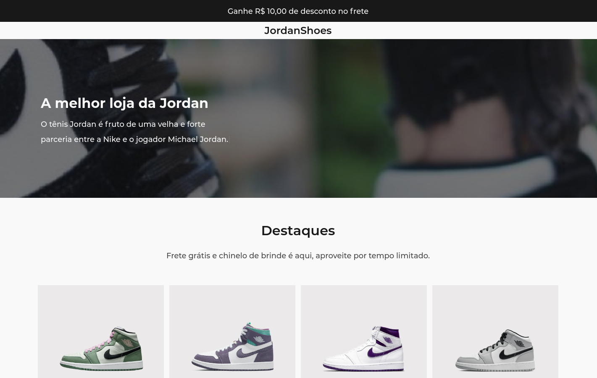

<p align="center">
    <a href="#-projeto">🖥 Projeto</a>&nbsp;&nbsp;&nbsp;|&nbsp;&nbsp;&nbsp;
    <a href="#-projeto">🔗 Links</a>&nbsp;&nbsp;&nbsp;|&nbsp;&nbsp;&nbsp;
    <a href="#-tecnologias">👨‍💻 Tecnologias</a>&nbsp;&nbsp;&nbsp;|&nbsp;&nbsp;&nbsp;
    <a href="#-executar-o-projeto">🖇 Execução do Projeto</a>&nbsp;&nbsp;&nbsp;|&nbsp;&nbsp;&nbsp;
    <a href="#-licença">📃 Licença</a>&nbsp;&nbsp;&nbsp;|&nbsp;&nbsp;&nbsp;
    <a href="#-observações">📌 Observações</a>
</p>
<div style="display: flex; flex-direction: row; justify-content: center; align-items: center; flex-wrap: wrap"  align="center">
    
        
</div>

## 🖥 Projeto
O **JordanSHoes** é um projeto desenvolvido como desafio do @iuricode. Nesse projeto foi desenvolvido uma mini plataforma de exibição de calçados, totalmente responsivo. Além da integração de animações usando as bibliotexas: **scrollreveal** e **typed**.

## 👨‍💻 Tecnologias
As tecnologias usadas nesse projeto foram:
- [HTML](https://developer.mozilla.org/en-US/docs/Web/HTML)
- [CSS](https://developer.mozilla.org/en-US/docs/Web/CSS)
- [JS](https://developer.mozilla.org/en-US/docs/Web/JavaScript)
- [ScrollReveal](https://scrollrevealjs.org/)
- [Typed](https://mattboldt.com/demos/typed-js/)


## 🔗 Links

🤖 Link para o projeto hospeado: [Jordan Shoes](https://yta-ux.github.io/codelandia/jordan-shoes/)

🎨 Link para o design do projeto: [Figma - Jordan Shoes](https://www.figma.com/file/Yb9IBH56g7T1hdIyZ3BMNO/Desafios---Codel%C3%A2ndia?node-id=1883%3A2&t=a3itppwhS5YjTWDP-0)


## 🖇 Executar o Projeto
Para executar o projeto, apenas é preciso clonar ele em seu dispositivo:

- Clone o repositório:
    ```bash
    $ git clone https://github.com/Yta-ux/codelandia.git
    ```
- Acesse a pasta do projeto:
    ```bash
    $ cd codelandia/jordan-shoes
    ```
 
##  📃 Licença
Esse projeto possui licença MIT. Para mais detalhes consulte o arquivo [LICENSE](LICENSE.md)


## 📌 Observações
- Projeto totalmente responsivo;
- Desafio promovido pelo [iuricode](https://github.com/iuricode);
