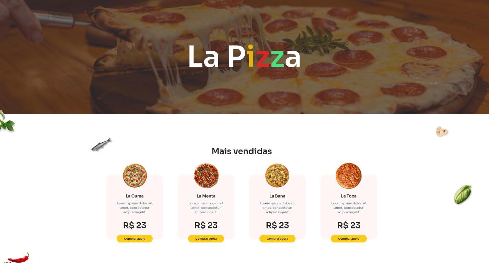

<p align="center">
    <a href="#-projeto">🖥 Projeto</a>&nbsp;&nbsp;&nbsp;|&nbsp;&nbsp;&nbsp;
    <a href="#-tecnologias">👨‍💻 Tecnologias</a>&nbsp;&nbsp;&nbsp;|&nbsp;&nbsp;&nbsp;
    <a href="#-projeto">🎨 Layout</a>&nbsp;&nbsp;&nbsp;|&nbsp;&nbsp;&nbsp;
    <a href="#-executar-o-projeto">🖇 Execução do Projeto</a>&nbsp;&nbsp;&nbsp;|&nbsp;&nbsp;&nbsp;
    <a href="#-licença">📃 Licença</a>&nbsp;&nbsp;&nbsp;|&nbsp;&nbsp;&nbsp;
    <a href="#-observações">📌 Observações</a>
</p>
<div align="center">
    
</div>


## 🖥 Projeto
O projeto é um **La Pizza** desenvolvido como desafio do @iuricode, É uma landing page que apresenta uma pizzaria, contudo nesse projeto foi usado tailwind para desenvolver todo o frontend.

## 👨‍💻 Tecnologias
As tecnologias usadas nesse projeto foram:
- [HTML](https://developer.mozilla.org/en-US/docs/Web/HTML)
- [CSS](https://developer.mozilla.org/en-US/docs/Web/CSS)
- [Tailwind](https://tailwindcss.com/)

## 🎨 Layout
Link para o design do projeto: [La Pizza](https://www.figma.com/file/OFPmaR4BYJd7QeChEOzHgL/Desafios---Codel%C3%A2ndia-(Copy)?node-id=31145%3A4)
## 🖇 Executar o Projeto
Para executar o projeto, apenas é preciso clonar ele em seu dispositivo:

- Clone o repositório
    ```bash
    $ git clone https://github.com/Yta-ux/la-pizza.git
    ```

##  📃 Licença
Esse projeto possui licença MIT. Para mais detalhes consulte o arquivo [LICENSE](LICENSE.md)

## 📌 Observações
- Projeto Responsivo;
- Desafio promovido pelo [iuricode](https://github.com/iuricode);